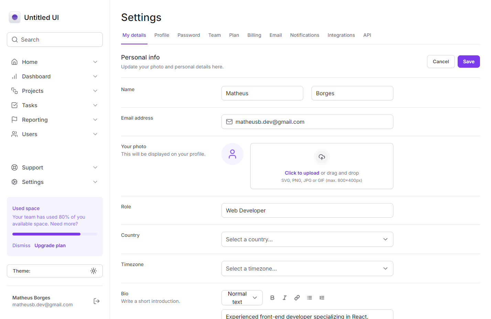
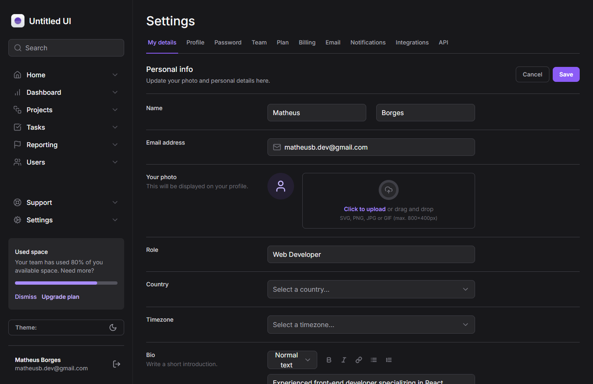

# Dashboard Tailwind Master

## Application created to master Tailwind CSS skills.

> The project aimed to improve knowledge about Tailwind CSS, Theme API, Responsiveness, Breakpoints, Dark Mode, Animations, Image context and components variants, using React, Next.JS, TypeScript and Tailwind CSS to build it.

🔗 [Click here to access](https://tailwind-master-phi.vercel.app/)

## 💻 Technologies

- React
- Next.JS
- Typescript
- Tailwind CSS
- Figma

## 📧 Contact

matheusb.dev@gmail.com

## 📝 License

This project is under the MIT license.
